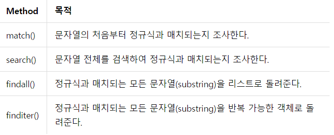
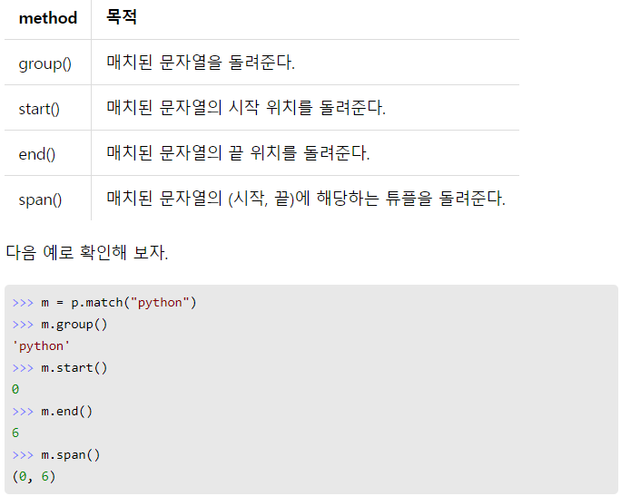

```python
import re

# 문자열에서 숫자 제외한 문자들 출력
expressions = re.findall("\D", expression)

# 문자열에서 문자들을 기준으로 분리
temp = re.split('([^0-9])', expression)


[a-zA-Z] # 알파벳 모두
[0-9]    # 숫자
^		 # 반대
"\d"     # [0-9]와 동일한 표현. 숫자들 찾기
"\D"	 # 위와 반대
"\s"	 # [ \t\n\r\f\v]와 동일한 표현. whitespace 문자와 매치
"\S"	 # 위와 반대.
"\w"	 # [a-zA-Z0-9_]와 동일한 표현. 문자+숫자와 매치
"\W"	 # 위와 반대

```




- match, search는 반환시 아래의 방법 이용해야함.




### zip

```python
Number = [1,2,3,4]
Name = ['hong','gil','dong','nim']

Number_Name = list(zip(Number,name))

print(Number_Name)

'''
결과 : [(1 ,'hong'), (2 ,'gil'), (3 ,'dong'), (4 ,'nim')]
'''
```


